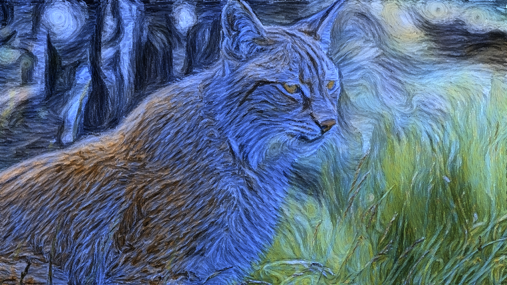
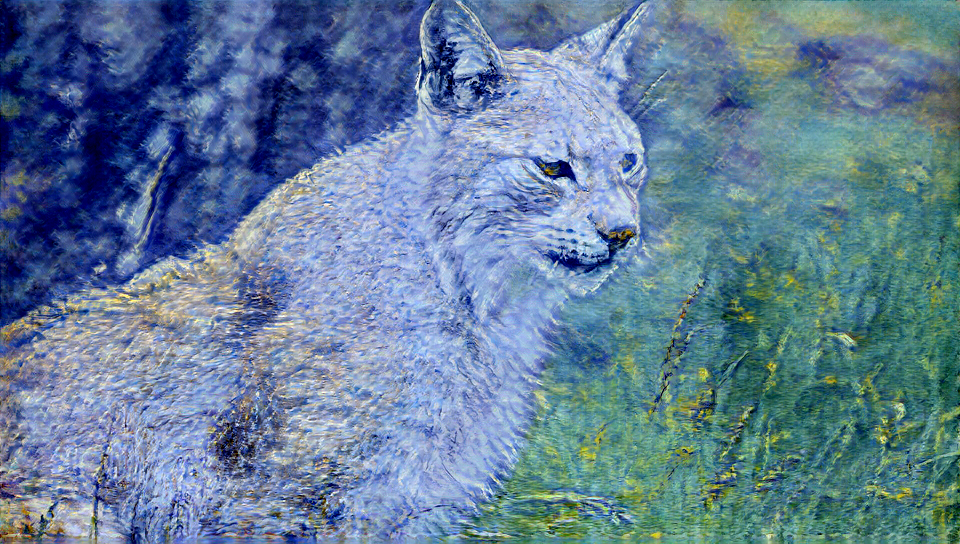
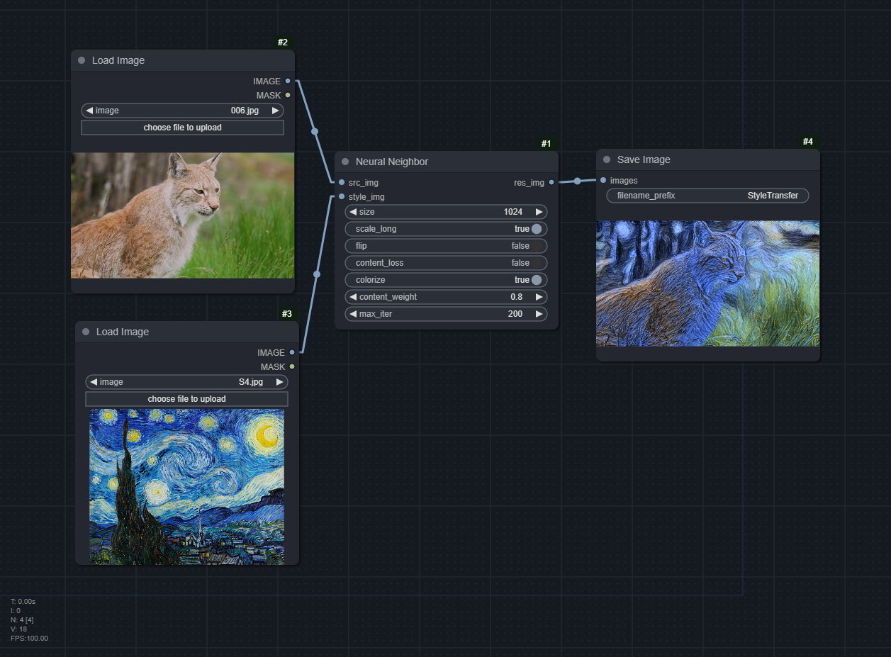
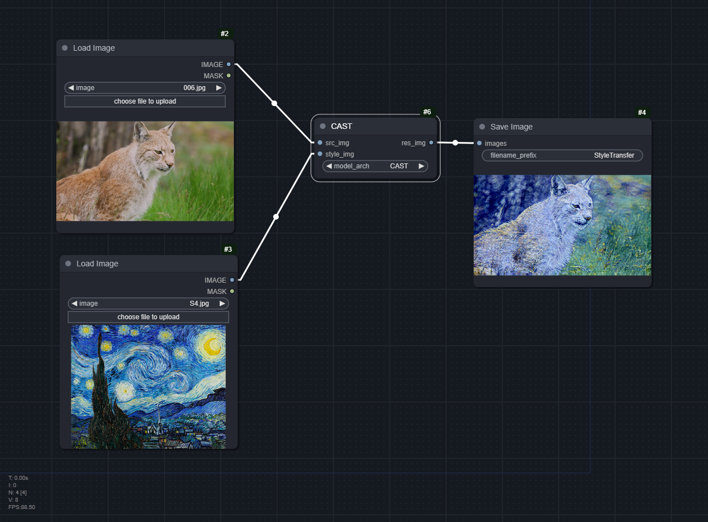

# ComfyUI-StyleTransferPlus
Advanced Non-Diffusion-based Style Transfer in ComfyUI

Click name to jump to workflow

1. [**Neural Neighbor**](#neural-neighbor). Paper: [Neural Neighbor Style Transfer](https://github.com/nkolkin13/NeuralNeighborStyleTransfer) 
2. [**CAST**](#cast). Paper: [Domain Enhanced Arbitrary Image Style Transfer via Contrastive Learning](https://github.com/zyxElsa/CAST_pytorch)

## Workflows

All nodes support batched input (i.e video) but is generally not recommended. One should generate 1 or 2 style frames (start and end), then use [ComfyUI-EbSynth](https://github.com/FuouM/ComfyUI-EbSynth) to propagate the style to the entire video.

| Neural Neighbor (2020-2022) - Slowest | CAST (2022) - Fast | X |
|:-:|:-:|-|
| |  | X | 

### Neural Neighbor

Arguments:
- `size`: Either `512` or `1024`, to be used for scaling the images. 1024 takes ~6-12 GB of VRAM. Defaults to `512`
- `scale_long`: Scale by the longest (or shortest side) to `size`. Defaults to `True`
- `flip`: Augment style image with rotations. Slows down algorithm and increases memory requirement. Generally improves content preservation but hurts stylization slightly. Defaults to `False`
- `content_loss`: Defaults to `True`
  > Use experimental content loss. The most common failure mode of our method is that colors will shift within an object creating highly visible artifacts, if that happens this flag can usually fix it, but currently it has some drawbacks which is why it isn't enabled by default [...]. One advantage of using this flag though is that [content_weight] can typically be set all the way to 0.0 and the content will remain recognizable.
- `colorize`: Whether to apply color correction. Defaults to `True`
- `content_weight`: weight = 1.0 corresponds to maximum content preservation, weight = 0.0 is maximum stylization (Defaults to 0.75)
- `max_iter`: How long each optimization step should take. `size=512` does 4 scaling steps * max_iter. `size=1024` does 5. The longer, the better and sharper the result.

See more information on the original repository. No model is needed.

[workflow_neural_neighbor.json](workflows/workflow_neural_neighbor.json)



### CAST

Download the CAST and UCAST models in the [Test](https://github.com/zyxElsa/CAST_pytorch?tab=readme-ov-file#test) section (Google Drive) (Unzip).

Download the `vgg_normalized` model in the [Train](https://github.com/zyxElsa/CAST_pytorch?tab=readme-ov-file#train) section

```
models\
│ .gitkeep
│ vgg_normalised.pth
─CAST_model
│   latest_net_AE.pth
│   latest_net_Dec_A.pth    # Safe to delete
│   latest_net_Dec_B.pth
│   test_opt.txt            # Safe to delete
│
└─UCAST_model
    latest_net_AE.pth 
    latest_net_Dec_A.pth    # Safe to delete
    latest_net_Dec_B.pth
```

[workflow_cast.json](workflows/workflow_cast.json)



## Credits

```
@inproceedings{zhang2020cast,
author = {Zhang, Yuxin and Tang, Fan and Dong, Weiming and Huang, Haibin and Ma, Chongyang and Lee, Tong-Yee and Xu, Changsheng},
title = {Domain Enhanced Arbitrary Image Style Transfer via Contrastive Learning},
booktitle = {ACM SIGGRAPH},
year = {2022}}

@article{zhang2023unified,
 title={A Unified Arbitrary Style Transfer Framework via Adaptive Contrastive Learning},
 author={Zhang, Yuxin and Tang, Fan and Dong, Weiming and Huang, Haibin and Ma, Chongyang and Lee, Tong-Yee and Xu, Changsheng},
 journal={ACM Transactions on Graphics},
 year={2023},
 publisher={ACM New York, NY}
}
```
